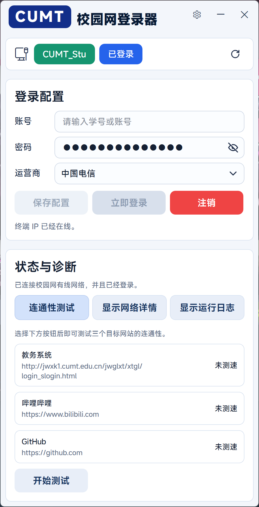
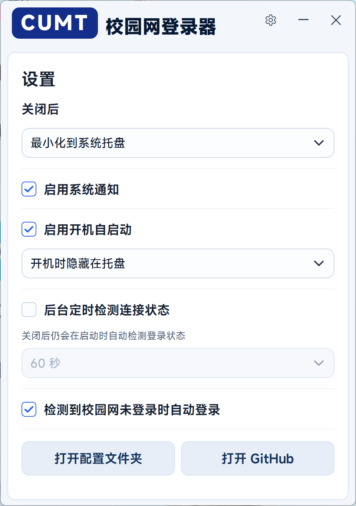
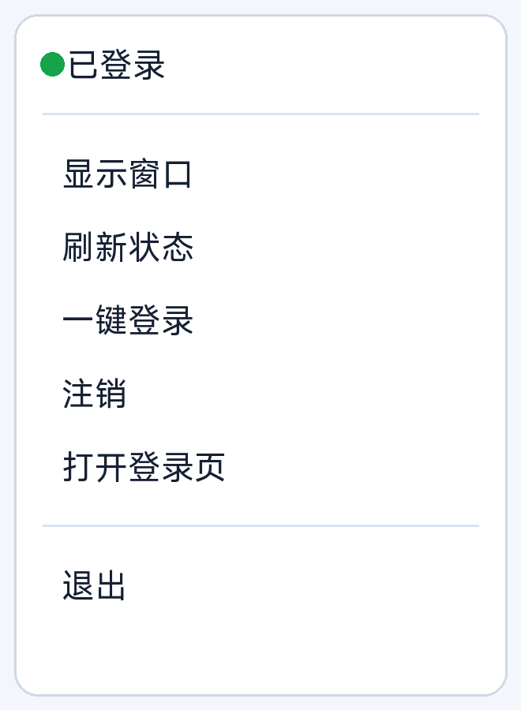

# CUMT 校园网登录器

一个用于中国矿业大学校园网的 Windows 桌面工具。软件可以检测校园网连接和登录状态，并在需要时自动完成登录。

## 主要功能

- 保存账号、密码和运营商选择。
- 检测当前是否连接校园网。
- 显示校园网登录状态。
- 支持手动登录、注销和刷新状态。
- 支持启动后自动检测登录状态。
- 支持检测到校园网未登录时自动登录。
- 支持后台定时检测连接状态。
- 支持系统托盘、系统通知和连通性测试。
- 额外适配门户返回“当前时段不允许上网”的情况，识别后会通知用户并停止无意义的自动检测。

## 主页

主页用于完成日常登录操作。顶部显示当前连接的校园网名称和登录状态；中间是账号、密码、运营商配置；下方提供连通性测试、网络详情和运行日志入口。

<p align="center">
  
</p>

常用操作：

- 点击“立即登录”执行校园网登录。
- 点击“注销”退出当前校园网登录。
- 点击右上角刷新按钮重新检测状态。
- 点击“连通性测试”检查常用网站访问情况。

## 设置

设置页用于控制关闭行为、通知、开机自启动、后台检测和自动登录。

<p align="center">
  
</p>

主要选项：

- 关闭后：选择最小化到托盘或直接退出。
- 启用系统通知：登录、断联、异常情况会通过 Windows 通知提醒。
- 启用开机自启动：开机后自动启动软件。
- 后台定时检测连接状态：按设定间隔持续检测登录状态。
- 检测到校园网未登录时自动登录：检测到已连接校园网但未登录时自动尝试登录。

## 托盘

软件可以常驻系统托盘。托盘顶部会显示当前登录状态，菜单中可以快速执行常用操作。

<p align="center">
  
</p>

托盘支持：

- 显示窗口
- 刷新状态
- 一键登录
- 注销
- 打开登录页
- 退出

托盘状态包括：

- 正在检测登录状态
- 正在登录
- 已登录
- 未登录

## 自动检测与自动登录

软件启动后会自动检测登录状态。即使关闭后台定时检测，启动时仍会自动检测登录状态。

如果开启自动登录，软件在检测到“已连接校园网但未登录”时会尝试登录。

以下情况会停止本次运行内的自动检测和自动登录：

- 用户主动注销。
- 当前时段不允许上网。
- 登录设备超限。
- 账号不存在。
- 账号或密码错误。

停止后，软件不会继续自动检测或自动登录。手动登录成功后会恢复自动检测和自动登录。

## 数据位置

配置和日志保存在：

```text
%APPDATA%\CUMT Campus Login\
```

当前版本的密码保存在本机配置文件中，请不要把 `config.json` 上传或发送给他人。

## 运行说明

如果使用已打包版本，解压后运行：

```text
CUMT-Campus-Login.exe
```

不要单独移动 exe，需保留完整文件夹。
